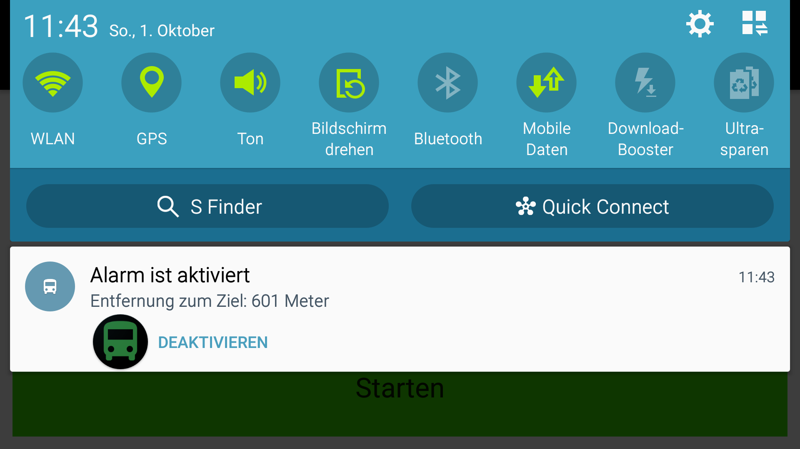

# GPS.Wecker
Nie wieder im Bus verschlafen.
Ein Wecker, der dich weckt, kurz bevor man am Ziel angekommen ist. Nützlich für alle, die zu wenig Schlaf haben und auch mal im Bus ausversehen einnicken und die Haltestelle verpassen. Es ist somit möglich, im z.B. Schulbus morgens noch eine halbe Stunde Schlaf ergattern. Andererseits auch gut, wenn man eine längere Zugfahrt hat. Der Wecker weckt, sobald man sich in einen festgelegten Radius um das zufor definierte Ziel begibt. Sobald dies geschieht, ertönt ein unüberhörbarer nervtötender Wecker. Dieser stoppt, wenn ein Button gedrückt wird. Danach schließt die App automatisch, falls man gerade in einem interessanten Videospiel war. Somit wird eines der nervigsten Problemen gelöst und der Schlaf der Schüler und Berufspendler ein wenig geschont.

    